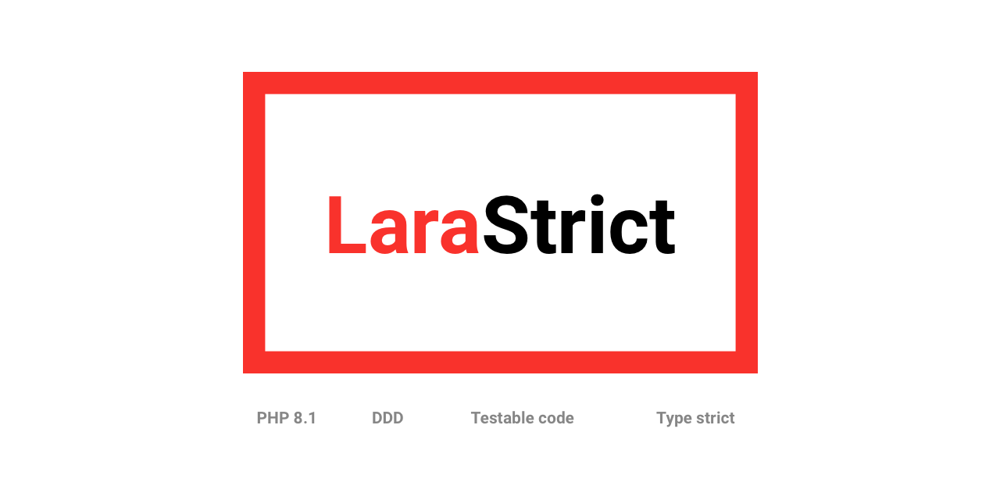

## Write Laravel projects with more strict conventions for more stable code in the long run

### This package is for those who likes to write little more code to enable easier debugging, managing, testing the **code**.

We aim to make set of futures to allow easier coding life of developer without loosing **type safe code.**

```bash
composer require wrkflow/larastrict
```

I've created this project as part of my mission to create `work flow` tools / libraries to make my (and yours) **dev life easier and more enjoyable**. Join my mission at [/wrk-flow.com](https://wrk-flow.com)

## Main mission

- Follows Domain Driven Development
- Make the code more testable via Unit tests (for faster tests)
- Make database queries reusable and testable -> `Queries`
- Make caching more reusable and testable -> `Cache`
- Move logic to `Actions` or `Services`

## Conventions

### Actions

Actions are designed for simple one way business logic "action" with `execute` function that must be implemented.

### Services

Contains business logic that is more "central" (has multiple methods). Something like `ManagePersonService` with `create/update/etc` methods.

Still its more attractive to creates actions for each method I've mentioned above.

### Database [docs](./src/Database/README.md)

#### Queries

The main problem with queries that they are hard to unit test. You can use `Mockery` but there are a limits. You can use
repositories, but then you tend to make them universal (with scopes) and yet again, they are hard to test.

With queries, you should always make simple class with `execute` method that do the thing we need without heavy property
customization. Always prefer to create new query that can be tested separately. 

### Console [docs](./src/Console/README.md)

Improved way how to register commands / schedules / views in more modular way (to follow DDD).
